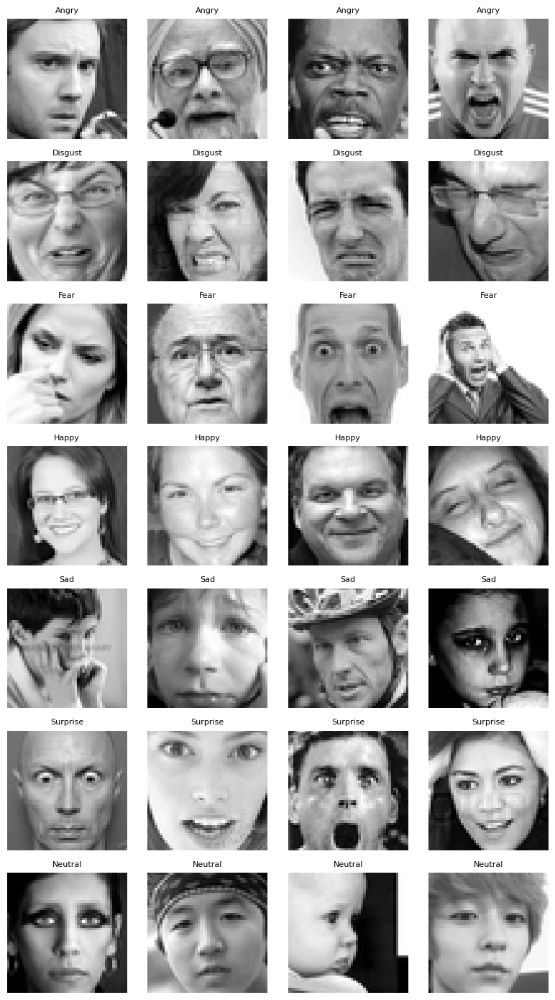
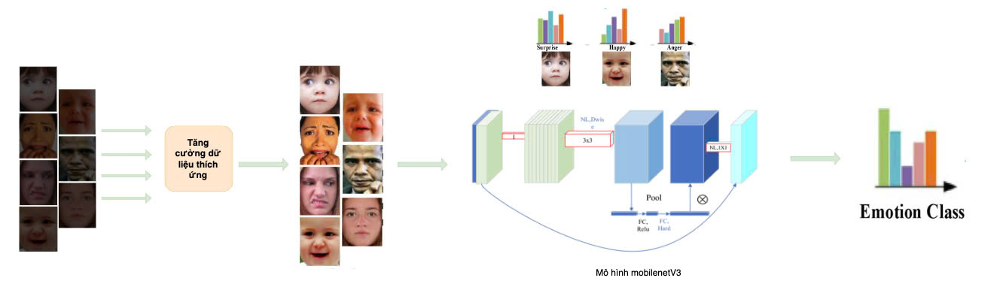
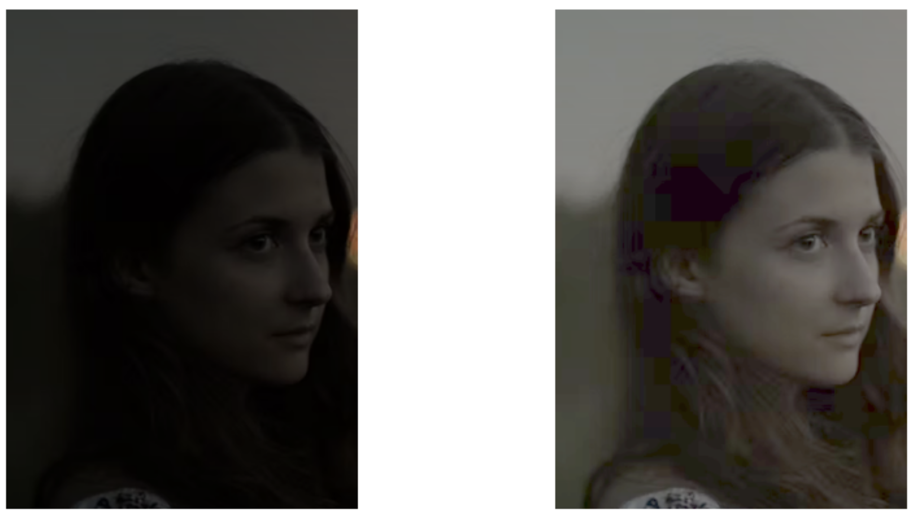
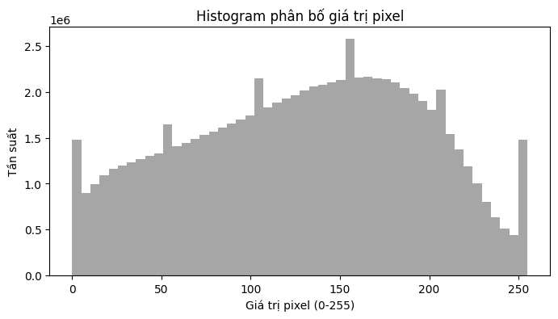
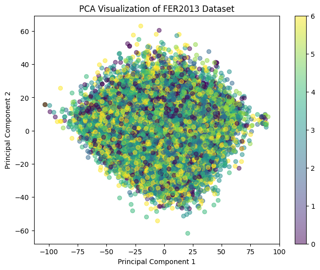
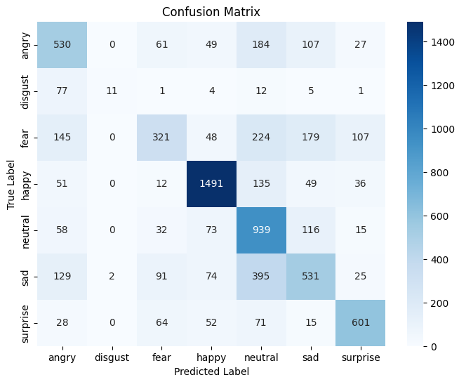
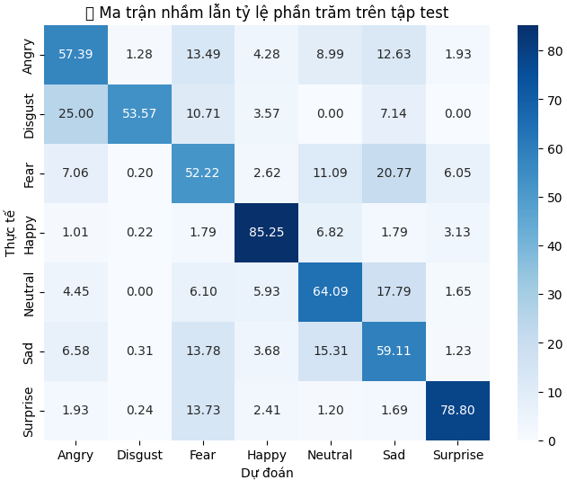

# 📘 Đồ án môn học: Phương pháp nghiên cứu khoa học (PPNCKH)

## 📝 Giới thiệu chung

Đây là repo chứa toàn bộ nội dung đồ án môn học **Phương pháp nghiên cứu khoa học**. Repo được tổ chức thành các thư mục tương ứng với các bài tập hàng tuần do giảng viên giao, các tài liệu phục vụ nghiên cứu, cũng như file ghi lại quá trình làm việc của từng thành viên trong nhóm.

## 🌟 Giới thiệu dự án

Dự án **"Nhận diện biểu cảm khuôn mặt trong điều kiện ánh sáng yếu sử dụng CNN nhẹ kết hợp kỹ thuật tăng cường dữ liệu thích ứng"** được thực hiện bởi **Nhóm 17** thuộc Khoa Công Nghệ Thông Tin, Trường Đại học Sài Gòn. Dự án tập trung vào việc phát triển một hệ thống nhận diện biểu cảm khuôn mặt (Facial Expression Recognition - FER) hiệu quả trong môi trường ánh sáng yếu, một thách thức lớn trong thị giác máy tính.

Chúng tôi sử dụng **MobileNetV3-Small**, một mô hình CNN nhẹ, tối ưu cho các thiết bị nhúng như điện thoại thông minh hoặc camera giám sát. Kết hợp với **kỹ thuật tăng cường dữ liệu thích ứng**, hệ thống tự động điều chỉnh các phương pháp tiền xử lý ảnh (gamma correction, CLAHE, contrast stretching) dựa trên đặc trưng ánh sáng của từng ảnh đầu vào. Dự án được huấn luyện và đánh giá trên tập dữ liệu **FER-2013**, bao gồm 7 biểu cảm khuôn mặt: Vui 😄, Buồn 😢, Giận dữ 😠, Ngạc nhiên 😲, Trung lập 😐, Sợ hãi 😨, và Kinh tởm 🤢.


|  |
|:-------------------------------------------------------------:|
| **Một số khuôn mặt mẫu từ FER-2013** (7 biểu cảm)             |


## 🎯 Mục tiêu nghiên cứu

1. **Xây dựng pipeline tăng cường dữ liệu thích ứng**: Tự động điều chỉnh các kỹ thuật tiền xử lý ảnh dựa trên mức độ ánh sáng của từng ảnh.
2. **Huấn luyện và tối ưu MobileNetV3-Small**: Đạt độ chính xác cao trong nhận diện biểu cảm khuôn mặt dưới điều kiện ánh sáng yếu.
3. **So sánh hiệu quả**: Đánh giá mô hình đề xuất với các kỹ thuật tăng cường cố định và mô hình CNN khác (ResNet18).


## 🔧 Quá trình thực hiện

### 1. Tiền xử lý dữ liệu
- **Chuẩn hóa ảnh**: Chuyển ảnh sang thang xám, đồng nhất kích thước (48x48 pixel) và loại bỏ nhiễu.
- **Mô phỏng ánh sáng yếu**: Giảm độ sáng kênh V trong không gian màu HSV (10-30% so với ảnh gốc) để tạo tập dữ liệu ánh sáng yếu (LLI).
- **Tăng cường dữ liệu thích ứng**:
  - **Gamma Correction**: Điều chỉnh độ sáng với \(\gamma < 1\) cho ảnh quá tối.
  - **CLAHE**: Tăng cường độ tương phản cục bộ, phù hợp với ảnh có vùng sáng-tối không đều.
  - **Contrast Stretching**: Cải thiện độ tương phản tổng thể.

 |
|:--------------------------------------------------------------------:|
| **Pipeline đề xuất**                                                 |


### 2. 🔍 Thuật toán đề xuất
Thuật toán tăng cường dữ liệu thích ứng được thiết kế để tự động chọn và áp dụng các kỹ thuật tiền xử lý phù hợp dựa trên đặc trưng ánh sáng của ảnh đầu vào. Quy trình bao gồm:

- **Bước 1: Phân tích độ sáng ảnh**:
  - Chuyển ảnh sang không gian màu HSV, tính giá trị trung bình kênh V (Value).
  - Phân loại ảnh thành 3 mức độ sáng: **Tối** (V < 0.3), **Bình thường** (0.3 ≤ V ≤ 0.7), **Sáng** (V > 0.7).

- **Bước 2: Lựa chọn kỹ thuật tiền xử lý**:
  - **Nếu ảnh Tối**: Áp dụng **Gamma Correction** (\(\gamma = 0.5\)) để tăng độ sáng, sau đó áp dụng **CLAHE** để cải thiện độ tương phản cục bộ.
  - **Nếu ảnh Bình thường**: Áp dụng **CLAHE** hoặc **Contrast Stretching** dựa trên độ tương phản histogram.
  - **Nếu ảnh Sáng**: Chỉ áp dụng **Contrast Stretching** để cân bằng độ tương phản.

- **Bước 3: Tăng cường dữ liệu bổ sung**:
  - Xoay ngẫu nhiên (±15°), lật ngang, và thêm nhiễu Gaussian để tăng tính đa dạng của dữ liệu.
  - Chuẩn hóa ảnh về kích thước 48x48 pixel và thang xám.

### 3. Quy trình thực thi thuật toán
```plaintext
Input: Ảnh đầu vào từ FER-2013
Output: Ảnh đã tiền xử lý và nhãn biểu cảm

1. Đọc ảnh, chuyển sang không gian màu HSV.
2. Tính giá trị trung bình kênh V.
3. Nếu V < 0.3:
     - Áp dụng Gamma Correction (γ = 0.5).
     - Áp dụng CLAHE (clip limit = 2.0).
4. Nếu 0.3 ≤ V ≤ 0.7:
     - Áp dụng CLAHE (clip limit = 2.0) hoặc Contrast Stretching dựa trên histogram.
5. Nếu V > 0.7:
     - Áp dụng Contrast Stretching.
6. Thêm tăng cường ngẫu nhiên: xoay, lật, nhiễu.
7. Chuẩn hóa ảnh về 48x48 pixel, thang xám.
8. Trả về ảnh đã xử lý và nhãn.
```

|  |
|:--------------------------------------------------------------------:|
| **Ảnh trước và sau khi áp dụng các kỹ thuật tiền xử lý**              |


### 4. Huấn luyện mô hình
- **MobileNetV3-Small**:
  - Sử dụng trọng số pre-trained trên ImageNet.
  - Tinh chỉnh 30 lớp cuối, đóng băng các lớp trước để giữ đặc trưng.
  - Kiến trúc đầu ra: Global Average Pooling → Dense (128, ReLU) → Dropout (0.3) → Dense (64, ReLU) → Dropout (0.3) → Dense (7, Softmax).
  - Hàm mất mát: Categorical Crossentropy.
  - Tối ưu hóa: Adam, early stopping (patience=3).
- **ResNet18** (đối chiếu):
  - Tinh chỉnh lớp fully connected cuối cho 7 lớp biểu cảm.
  - Huấn luyện với 20 epoch, sử dụng CrossEntropyLoss và Adam (learning rate 0.001).

### 5. Đánh giá và so sánh
- **Thiết bị triển khai**: MacBook Air M1 (CPU) và Google Colab (mô phỏng tài nguyên thấp).
- **Chỉ số đánh giá**: Accuracy, Precision, Recall, F1-score, thời gian suy luận, kích thước mô hình.
- **So sánh**:
  - MobileNetV3-Small với/ không tăng cường dữ liệu.
  - ResNet18 với/ không tăng cường dữ liệu.
  - MobileNetV3-Small so với ResNet18 và các nghiên cứu trước (VGGNet, InceptionNet, EnlightenGAN, RetinexNet).

---
## 📊 Kết quả đạt được

### 1. Độ chính xác
- **MobileNetV3-Small**:
  - FER-2013 gốc: **61.63%**.
  - FER-2013 ánh sáng yếu (LLI): **58.86%**.
  - FER-2013 LLI + tăng cường thích ứng: **61.55%** (cải thiện ~2.7% so với LLI).
- **ResNet18**:
  - FER-2013 gốc: **67.23%**.
  - FER-2013 LLI: **67.04%**.
  - FER-2013 LLI + tăng cường thích ứng: **67.48%** (vượt mô hình gốc).

### 2. Hiệu năng và kích thước
- **MobileNetV3-Small**: ~1 triệu tham số, kích thước 13.54 MB, thời gian suy luận 2.12 ms/ảnh.
- **ResNet18**: ~11.18 triệu tham số, kích thước 42.72 MB, thời gian suy luận 2.91 ms/ảnh.

### 3. Phân tích
|  |  |
|:-------------------------------------------------------:|:--------------------------------------------------:|
| **Phân bố pixel FER-2013**       | **Trực quan hóa PCA**         |

- **Phân bố pixel**: Biểu đồ histogram cho thấy sự đa dạng về độ sáng và tương phản trong FER-2013, phản ánh tính phức tạp của dữ liệu.
- **Trực quan hóa PCA**: Dữ liệu FER-2013 phân bố chồng chéo, cho thấy khó khăn trong việc tách biệt các lớp biểu cảm.

|  |  |
|:----------------------------------------------------------------------:|:-------------------------------------------------------------------:|
| **Ma trận nhầm lẫn MobileNetV3**            | **Ma trận nhầm lẫn ResNet18**                 |

- **Ma trận nhầm lẫn**:
  - **MobileNetV3-Small**: Biểu cảm "Happy" (95.4%) và "Surprise" (86.48%) đạt độ chính xác cao, nhưng "Disgust", "Fear", và "Sad" dễ bị nhầm lẫn (ví dụ: Disgust → Angry, Fear → Neutral/Sad).
  - **ResNet18**: Hiệu suất tốt hơn với "Happy" (85.25%) và "Surprise" (78.80%), nhưng vẫn gặp khó khăn với các biểu cảm tiêu cực.

### 4. So sánh với nghiên cứu trước
| Phương pháp | Accuracy (%) | F1-score (%) | Thời gian (ms) | Kích thước (MB) |
|------------|--------------|--------------|----------------|-----------------|
| VGGNet     | 70.5         | 69.0         | 10.2           | 500+            |
| InceptionNet | 72.3       | 71.0         | 8.5            | 200+            |
| EnlightenGAN | 68.0       | 66.5         | 15.0           | 1000+           |
| RetinexNet | 65.5         | 64.0         | 12.0           | 800+            |
| ResNet18 (LLI + adaptive) | 67.48 | 67.0         | 2.91           | 42.72           |
| MobileNetV3-Small (LLI + adaptive) | 61.55 | 60.0         | 2.12           | 13.54           |

**Nhận xét**: Phương pháp đề xuất cân bằng tốt giữa độ chính xác, tốc độ, và kích thước mô hình, vượt trội so với các phương pháp GAN về tính khả thi trên thiết bị nhúng.

---

## 🚀 Ý nghĩa thực tiễn

- **Cải thiện nhận diện trong ánh sáng yếu**: Tăng độ tin cậy cho các ứng dụng như giám sát an ninh, tương tác người-máy, hoặc chăm sóc sức khỏe tâm lý.
- **Tiết kiệm tài nguyên**: Sử dụng mô hình nhẹ và kỹ thuật tiền xử lý đơn giản, phù hợp với thiết bị giá rẻ, triển khai diện rộng.
- **Ứng dụng thực tế**: Hỗ trợ camera giám sát, thiết bị IoT, hoặc ứng dụng di động trong môi trường ánh sáng không lý tưởng.

---

## 🔮 Hướng phát triển

- **Mở rộng dữ liệu**: Thu thập tập dữ liệu ánh sáng yếu đa dạng hơn về độ tuổi, giới tính, và điều kiện môi trường.
- **Tối ưu mô hình**: Áp dụng quantization, pruning, hoặc thử nghiệm các kiến trúc nhẹ như EfficientNet.
- **Tăng cường tiền xử lý**: Sử dụng các phương pháp như Deep Image Enhancement hoặc GANs để cải thiện chất lượng ảnh.
- **Triển khai thực tế**: Đánh giá hệ thống trên thiết bị nhúng trong môi trường thực tế.

---

## 🙏 Lời cảm ơn

Chúng tôi xin gửi lời cảm ơn chân thành đến:
- **Khoa Công Nghệ Thông Tin, Trường Đại học Sài Gòn** đã tạo điều kiện thuận lợi.
- **Thầy Đỗ Như Tài** đã tận tình hướng dẫn.
- **Các thành viên nhóm**: Văn Tuấn Kiệt, Mai Phúc Lâm, Nguyễn Đức Duy Lâm, Nguyễn Hữu Lộc vì sự đoàn kết và nỗ lực.

---

## 📚 Tài liệu tham khảo

- Goodfellow, I. et al. (2013). Challenges in representation learning...
- Howard, A. et al. (2019a). Searching for MobileNetV3...
- Zhang, Y. et al. (2019b). EnlightenGAN: Deep light enhancement...
- (Danh sách đầy đủ trong báo cáo).

---

**Nhóm 17 - Trường Đại học Sài Gòn**  
**05/2025, TP.HCM**

## 📁 Cấu trúc thư mục

### Thư mục chính:

| Thư mục / File                               | Mô tả                                                                                         |
| ---------------------------------------------- | ----------------------------------------------------------------------------------------------- |
| `.ipynb_checkpoints`                         | Thư mục tạm sinh ra bởi Jupyter Notebook để lưu checkpoint tự động.                   |
| `anaconda_projects`                          | Các project thực hiện trong môi trường Anaconda.                                          |
| `Bài 3` `Bài 4, Bài 5, Bài 6, Bài 7`         | Các bài tập tuần theo thứ tự giảng viên giao.                                           |
| `bai_tap_python`                             | Tổng hợp các bài tập Python đã thực hiện.                                              |
| `BaiBaoDaDoc`                                | Thư mục lưu trữ các bài báo đã đọc và nghiên cứu trong quá trình làm đồ án. |
| `De_cuong`  `De_cuong_2`                     | File đề cương đồ án, kế hoạch thực hiện hoặc tổng quan nội dung.                  |
| `EDA_FER2013/eda.ipynb`                      | Notebook phân tích dữ liệu EDA trên bộ dữ liệu FER2013.                                 |
| `ThietKeThuatToan`                           | Thư mục chứa nội dung thiết kế thuật toán và file kiểm thử.                          |
| `KeHoachThucNghiem`                          | Thư mục chứa nội dung các file code thực nghiệm trong quá trình làm đồ án.                          |

---

## 📄 Các file quan trọng

| File                                | Mô tả                                                                          |
| ----------------------------------- | -------------------------------------------------------------------------------- |
| `.gitignore`                      | File cấu hình Git để bỏ qua các file/thư mục không cần theo dõi.      |
| `[Tutorial] EDA-Python (1).ipynb` | Notebook hướng dẫn sử dụng Python cho phân tích dữ liệu.                |
| `README.md`                       | Tài liệu giới thiệu tổng quan về repo và đồ án (chính là file này). |
| `Tracking_Kiet.md`                | File theo dõi công việc, tiến độ của bạn **Kiệt**.                 |
| `Tracking_Lam.md`                 | File theo dõi công việc, tiến độ của bạn **Duy Lâm**.               |
| `Tracking_Loc.md`                 | File theo dõi công việc, tiến độ của bạn **Lộc**.                  |
| `Tracking_PLam.md`                | File theo dõi công việc, tiến độ của bạn **Phúc Lâm**.               |

---

## Phân chia nhiệm vụ

Mọi vấn đề về chia nhiệm vụ cho từng thành viên được thực hiện ở [file excel](https://docs.google.com/spreadsheets/d/1fQEhZhOme_cUPzWFHYGgAEzErR-zbi63u4UeUeJ06Mo/edit?gid=700579882#gid=700579882) (file excel cập nhật hàng tuần)

## Kế hoạch thực nghiệm

Mọi vấn đề về kế hoạch thực nghiệm cho dự án cuối môn được thực hiện ở [file excel](https://docs.google.com/spreadsheets/d/1BYEiQDNeR3SQME8fLpjtJrljtBMBBZSAvlPewkP45Yo/edit?gid=0#gid=0) (file excel cập nhật hàng tuần)

## 👥 Thành viên nhóm 17

| Họ và tên           | Email                                                | GitHub                                                  | Website cá nhân                                                                      |
| ---------------------- | ---------------------------------------------------- | ------------------------------------------------------- | -------------------------------------------------------------------------------------- |
| Nguyễn Hữu Lộc      | [lockbkbang@gmail.com](mailto:lockbkbang@gmail.com)     | [github.com/LocNguyenSGU](https://github.com/LocNguyenSGU) | [http://locnguyensguportfolio.store](http://locnguyensguportfolio.store) |
| Nguyễn Đức Duy Lâm | [duylam468213@gmail.com](mailto:duylam468213@gmail.com) | [github.com/duylam15](https://github.com/duylam15)         | [porfolio-cyan-nine.vercel.app](https://porfolio-cyan-nine.vercel.app/)                   |
| Mai Phúc Lâm         | [lamkbvn@gmail.com](mailto:lamkbvn@gmail.com)           | [github.com/lamkbvn](https://github.com/lamkbvn)           | [lamkbvn.github.io/trang-ca-nhan/](https://lamkbvn.github.io/trang-ca-nhan/)              |
| Tên thành viên 4    | [email4@example.com](mailto:email4@example.com)         | [github.com/username4](https://github.com/username4)       | [gắn link vô](#)                                                                        |

## ✅ Ghi chú

- Mỗi thư mục tương ứng với một bài học, nhiệm vụ hoặc nội dung thực hành được giao theo tuần.
- Các file `Tracking_*.md` được sử dụng để ghi lại tiến độ cá nhân, ghi chú công việc hoặc các vấn đề gặp phải.
- Các file notebook (`.ipynb`) là nơi triển khai, thử nghiệm và trình bày quá trình phân tích dữ liệu, xây dựng thuật toán,...

---


> 🧠 Sau môn này, đầu đã to hơn, não đã căng hơn, bug cũng nhiều hơn – nhưng đổi lại là một tư duy “data-driven” và mindset phân tích sắc bén không thua gì Sherlock Holmes. Tạm biệt môn học đã khiến chúng tôi mất ngủ nhưng lại khai sáng cả một chân trời kiến thức mới! 🚀😄.

